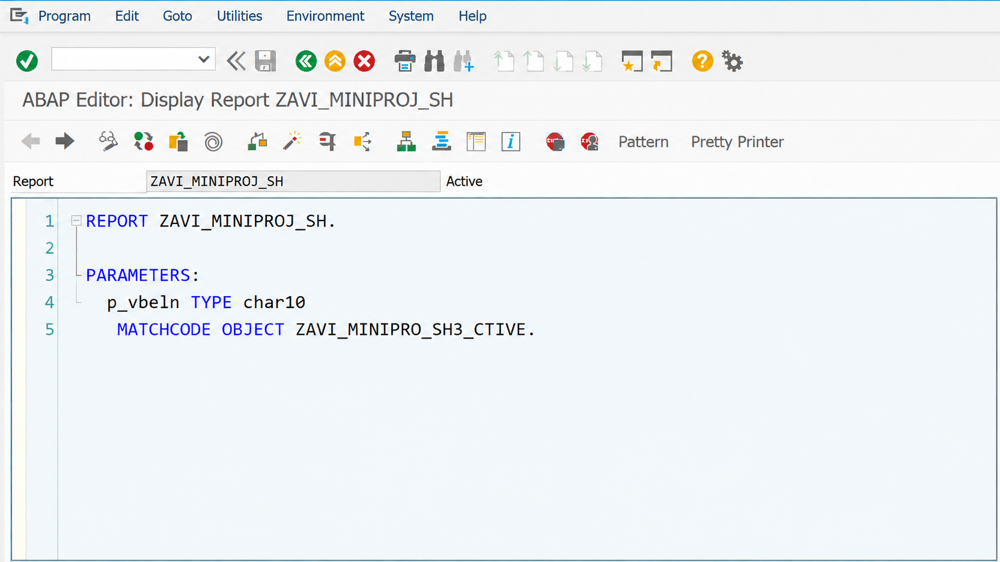
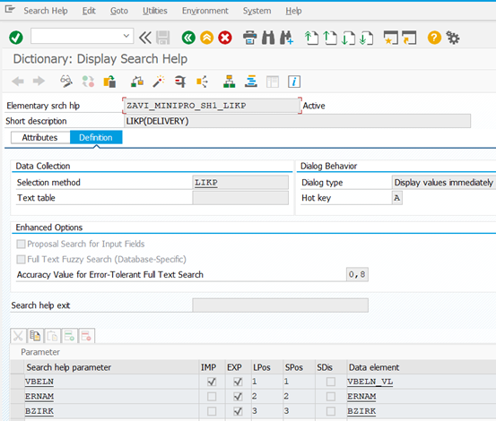
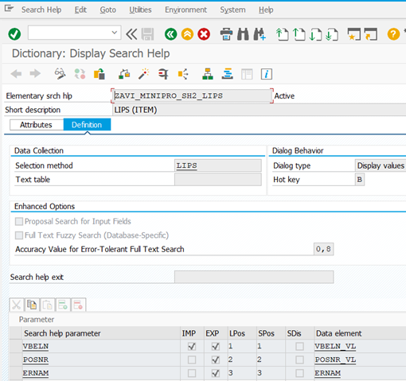
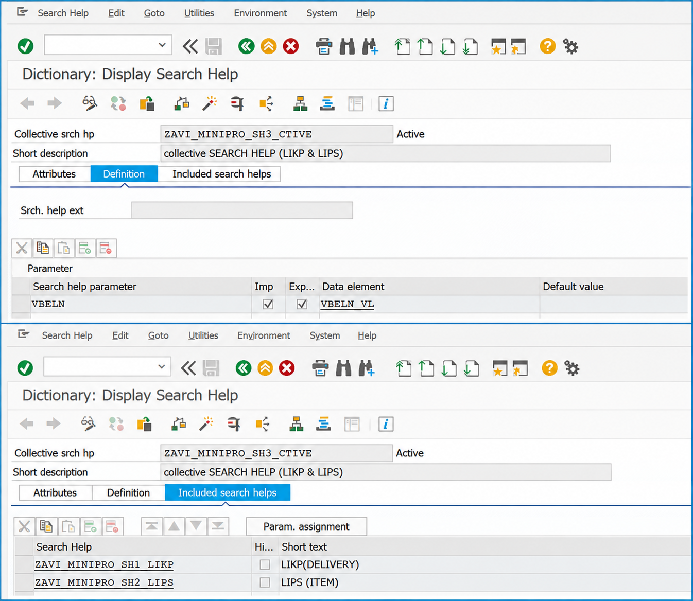
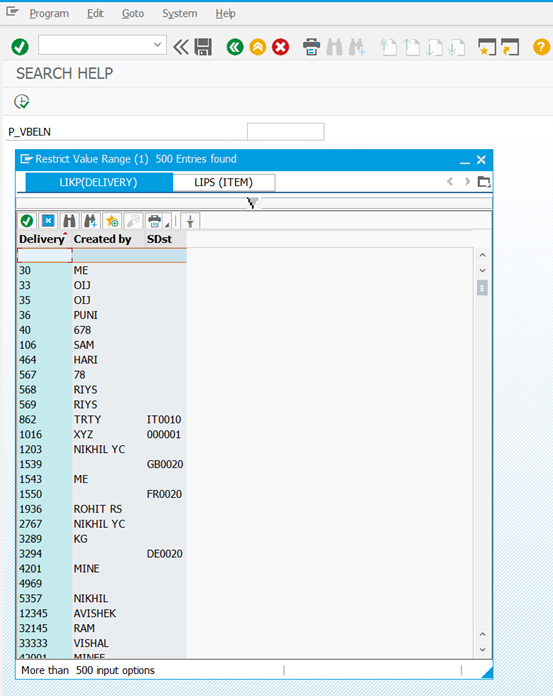

# SAP-ABAP-Search-Help-Project
<!--SAP ABAP project demonstrating the implementation of Elementary and Collective Search Helps using LIKP and LIPS tables. Developed a unified F4 help interface to improve data retrieval, user navigation, and search functionality within SAP applications.
-->

<!--# SAP ABAP Collective Search Help -->

## Project Information

| Attribute        | Details                             |
| ---------------- | ----------------------------------- |
| Project Name     | SAP ABAP Collective Search Help     |
| Project Type     | SAP ABAP Mini Project               |
| Module           | SAP ABAP                            |
| Object Type      | Collective Search Help              |
| Tables Used      | LIKP, LIPS                          |
| Search Help Type | Elementary & Collective Search Help |
| Development Tool | SAP Data Dictionary (DDIC)          |

---

## Project Overview

This project demonstrates the development of a custom SAP ABAP Collective Search Help by combining multiple Elementary Search Helps into a single reusable search interface.

The solution enables users to retrieve both Delivery Header and Delivery Item information through a unified F4 Help, improving usability and simplifying data selection within SAP applications.

---

## Business Scenario

In many SAP business processes, users need quick access to delivery-related information while entering or searching for documents.

Instead of maintaining separate search helps for Delivery Header Data (LIKP) and Delivery Item Data (LIPS), a Collective Search Help was designed to provide both datasets through a single search interface.

This approach improves user experience and reduces navigation complexity.

---

## Objective

* Create custom Elementary Search Helps.
* Develop a Collective Search Help.
* Integrate multiple Search Helps into a single F4 Help.
* Enable efficient delivery document search.
* Demonstrate SAP Data Dictionary (DDIC) concepts.

---

## Technical Implementation

### Step 1: Elementary Search Help for LIKP

Created an Elementary Search Help using the LIKP (Delivery Header) table.

#### Fields Included

| Field | Description     |
| ----- | --------------- |
| VBELN | Delivery Number |
| ERNAM | Created By      |
| BZIRK | Sales District  |

---

### Step 2: Elementary Search Help for LIPS

Created an Elementary Search Help using the LIPS (Delivery Item) table.

#### Fields Included

| Field | Description     |
| ----- | --------------- |
| VBELN | Delivery Number |
| POSNR | Item Number     |
| ERNAM | Created By      |

---

### Step 3: Collective Search Help

Created a Collective Search Help that combines:

* ZAVI_MINIPRO_SH1_LIKP
* ZAVI_MINIPRO_SH2_LIPS

The Collective Search Help allows users to switch between Delivery Header and Delivery Item information within the same search interface.

---

### Step 4: Matchcode Object Integration

```abap
PARAMETERS:
  p_vbeln TYPE char10
  MATCHCODE OBJECT ZAVI_MINIPRO_SH3_CTIVE.
```

The `MATCHCODE OBJECT` keyword links the selection screen parameter `P_VBELN` with the custom Collective Search Help.

When the user presses **F4**, SAP automatically invokes the assigned Search Help and displays available delivery data.

#### Benefits

* Simplified user input
* Faster data selection
* Reduced manual entry errors
* Improved user experience
* Reusable Search Help integration across SAP applications

---

## Tables Used

| Table | Description          |
| ----- | -------------------- |
| LIKP  | Delivery Header Data |
| LIPS  | Delivery Item Data   |

---

## Technologies Used

* SAP ABAP
* SAP Data Dictionary (DDIC)
* Elementary Search Help
* Collective Search Help
* Matchcode Object
* Selection Screen Programming

---

## Skills Demonstrated

* SAP ABAP Development
* SAP Data Dictionary (DDIC)
* Elementary Search Help Configuration
* Collective Search Help Development
* Matchcode Object Integration
* Selection Screen Programming
* SAP Data Modeling

---

## Business Benefits

* Reduces manual data entry through F4 Help integration.
* Improves delivery document search efficiency.
* Provides a unified search interface for header and item data.
* Enhances user productivity and navigation.
* Supports reusable SAP Data Dictionary objects.

---

## Project Architecture

```text
                    ┌────────────┐      ┌────────────┐
                    │    LIKP    │      │    LIPS    │
                    │  Header    │      │    Item    │
                    └─────┬──────┘      └─────┬──────┘
                          │                   │
                          ▼                   ▼

                    ┌────────────┐      ┌────────────┐
                    │ SH1_LIKP   │      │ SH2_LIPS   │
                    │ Elementary │      │ Elementary │
                    └─────┬──────┘      └─────┬──────┘
                          │                   │
                          └─────────┬─────────┘
                                    ▼

                       ┌─────────────────────┐
                       │      SH3_CTIVE      │
                       │   Collective SH     │
                       └──────────┬──────────┘
                                  │
                                  ▼

                       ┌─────────────────────┐
                       │   ABAP Selection    │
                       │  Screen (F4 Help)   │
                       └──────────┬──────────┘
                                  │
                                  ▼

                       ┌─────────────────────┐
                       │   User Selection    │
                       │    Delivery Data    │
                       └─────────────────────┘
```

---

## Screenshots

### ABAP Program



### Elementary Search Help – SH1_LIKP



### Elementary Search Help – SH2_LIPS



### Collective Search Help Configuration



### Final Output



---

## Key Learnings

* SAP Data Dictionary (DDIC)
* Search Help Creation
* Elementary Search Helps
* Collective Search Helps
* Matchcode Objects
* Selection Screen Development
* SAP ABAP Report Integration

---

## Future Enhancements

* Implement custom Search Help Exits.
* Add advanced filtering capabilities.
* Integrate additional delivery-related tables.
* Support dynamic search criteria.
* Extend functionality for other SAP modules.

---

## Outcome

Successfully developed and integrated a custom Collective Search Help that combines delivery header and item information into a single reusable F4 Help.

The solution improves user navigation, simplifies document search, and demonstrates practical implementation of SAP Data Dictionary concepts.

---

## Author

**Avishek Chourasiya**

SAP ABAP Developer Intern | Computer Science Student

LinkedIn: linkedin.com/in/avishek-chourasiya
